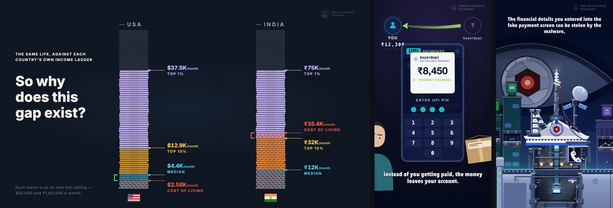

# Indian Finance Academy — films

Source code, storyboards and production assets for three films from
[**Indian Finance Academy**](https://www.youtube.com/@IndianFinanceAcademy), a finance-documentary
YouTube channel. Every frame is animated programmatically — React and TypeScript on
[Remotion](https://www.remotion.dev), with FFmpeg for encoding and muxing. Each film is a program
whose clock is its narration.



| Film | Format | Runtime | Watch | Source | Storyboard & docs |
|---|---|---|---|---|---|
| **It's Not Just You: India Has a Real Structural Economic Problem**<br><sub>working title: *What no one tells you about your income percentile in India*</sub> | 16:9 · 1920×1080 · 30 fps | 8:21 | [YouTube](https://www.youtube.com/watch?v=P9wEO_TRy9E) | [`src/income-percentile`](src/income-percentile) | [`docs/income-percentile`](docs/income-percentile) |
| **This UPI Request Can Empty Your Account**<br><sub>UPI collect-request fraud</sub> | Short · 9:16 · 1080×1920 · 60 fps | 0:50 | [YouTube](https://www.youtube.com/shorts/_GaIGokHL5o) | [`src/upi-scam`](src/upi-scam) | [`docs/upi-scam`](docs/upi-scam) |
| **This WhatsApp Message Can Empty Your Bank Account**<br><sub>fake e-Challan malware</sub> | Short · 9:16 · 1080×1920 · 60 fps | 2:08 | [YouTube](https://www.youtube.com/shorts/_-A-RW-yAME) | [`src/echallan`](src/echallan) | [`docs/echallan`](docs/echallan) |

The final masters are attached to the
[**v1.0 release**](https://github.com/guhanp09/indian-finance-academy-films/releases/tag/v1.0).
Rendering this repository reproduces them — same frame counts, and sampled frames match the
published masters.

---

## How the films are built

**The narration is the clock.** No visual event in any of these films is placed at a typed frame
number.

1. **Lock the script and split it into beats.** Each film's script is locked verbatim and cut into
   fragments at the words that motivate a visual event (`docs/income-percentile/script.md`,
   `tools/upi-scam/fragments.mjs`, `tools/echallan/fragments.mjs`). In the Shorts a check proves the
   fragments reassemble the script character for character, so the subtitles cannot drift from it.
2. **Measure the recording.** The recorded narration is force-aligned against the locked script, and
   every word's start and end is written into a timing file (`timing.json` / `narration.json`).
3. **Anchor everything to measured words.** Scenes animate against `beat(i)` or `at('phrase')`,
   statistics land on the exact frame their number is spoken, and camera keys, colour stops and
   sound cues are all offsets from a word. Re-record the voice, re-run one tool, and the whole film
   re-times itself — the numbers move, the structure does not.
4. **Derive the rest from the same clock.** Subtitles (burned-in pages for the Shorts, SRT/VTT for
   the long film), the sound design and the end card all read the timing file.
5. **Gate the render.** Automated QA checks run against the source and the finished video — see
   below.
6. **Render and deliver.** Remotion renders the picture — in chunks with a stall watchdog for the
   15,000-frame film, whose narration FFmpeg then muxes back on in one piece — and the e-Challan
   master is normalised to limited-range yuv420p for YouTube.

### Design before animation

- **Pre-mortems.** Before a frame was animated, each Short got a written pre-mortem — every way the
  plan could be followed to the letter and still fail — with the mechanism that prevents each one
  ([UPI](docs/upi-scam/premortem.md), [e-Challan](docs/echallan/premortem.md)).
- **Boards before renders.** Hard moments are boarded as stills rendered from the film's own
  components, and alternatives are compared side by side
  ([e-Challan boards](docs/echallan), [UPI "no PIN" options](docs/upi-scam/nopin-options.html),
  [income-percentile explorations](docs/income-percentile/explorations)).
- **Production rules.** The standing rules every asset and move is held to, referenced by name in
  the code: [`docs/production-rules.md`](docs/production-rules.md).
- **Review rounds, logged.** What each round of review found and what was changed:
  [e-Challan](docs/echallan/opening-transitions.md), [UPI](docs/upi-scam/production-notes.md).

### Automated QA

| film | gate | what it proves |
|---|---|---|
| income percentile | `qa-numbers.mjs` | every statistic reaches its value exactly on the narrated frame, and is strictly short of it on the frame before |
| | `qa-sync.mjs` | nothing moves before the narration that motivates it; every act seam overlaps, so no frame goes blank |
| | `qa-motion.mjs` | every easing curve is continuous in value and velocity; no frame carries an outsized share of a move |
| | `qa-holds.mjs` | every run of identical frames, reported against the words spoken across it |
| UPI scam | `qa.mjs` | no blank frames; no hard cuts (per-frame luminance delta); no state held past ~0.8 s; the reversal still reads in greyscale; nothing bright in the Shorts UI zone |
| e-Challan | `qa.mjs` | the same post-render gates, with the film's arguments checked in greyscale and nothing detailed in the Shorts UI band |
| | `camera.mjs` | every camera move as screen-space optical flow: no dead stop inside a move, no smear, no arrival harder than its speed allows |
| | `taps.mjs`, `focus.mjs` | every tap lands on what it is drawn pressing; each permission is held long enough to register |
| | `act3.mjs`, `act4.mjs` | the reveal and the outro: staging, framing, and that every stolen object actually arrives |
| | `captions.mjs` | which edge each caption page sits on, measured off the picture rather than typed |

---

## Repository layout

```
src/
  income-percentile/   the 16:9 film — eight acts, a React-free state/timing module, the income
                       "meter" rig, odometers, write-on paths, end card
  upi-scam/            the UPI Short — design system, camera, timeline, the phone/ledger/figures world
  echallan/            the e-Challan Short — v2/ is the delivered film (composition "Opening"),
                       world/ the asset kit, scenes/ the first-pass cut kept for reference
  shared/              the caption paging module both Shorts use
tools/
  income-percentile/   chunked renderer, word-cue alignment, SRT/VTT export, QA gates
  upi-scam/            narration ingest + alignment, procedural score/SFX, QA
  echallan/            narration ingest + alignment, score, camera/staging/caption gates, renderer
docs/
  production-rules.md  the rules the films are built and checked against
  income-percentile/   script, storyboard, explorations
  upi-scam/            script, pre-mortem, production notes, hand spec, option board, storyboard
  echallan/            pre-mortem, transition log, status, boards + frames, storyboard
public/                brand marks and the final audio mixes the compositions load
```

## Running it

Requires Node 20+ and FFmpeg. Remotion downloads its headless Chromium on first run.

```bash
npm ci

npm run studio:income-percentile     # open a film in Remotion Studio and scrub it
npm run studio:upi-scam
npm run studio:echallan

npm run render:income-percentile     # full renders into output/
npm run render:upi-scam
npm run render:echallan
```

The narration-ingest and alignment tools under `tools/*/` expect a local Python environment at
`.venv-asr/`, which is not part of this repository; everything needed to render the films as
published — timing files, cues, audio mixes — is committed.

---

© 2026 Indian Finance Academy. Shared as a portfolio of work; all rights reserved.
