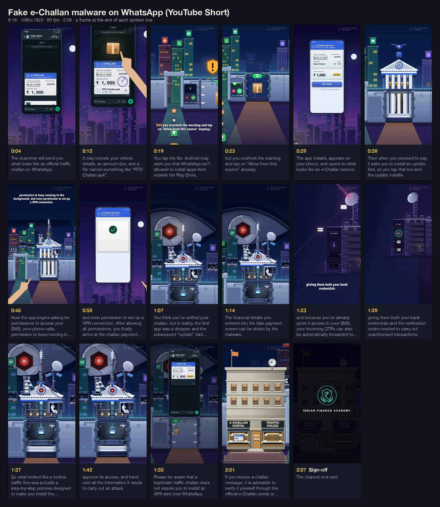

# This WhatsApp Message Can Empty Your Bank Account

Fake e-Challan malware · YouTube Short · 9:16 · 1080×1920 · 60 fps · 2:08 —
[watch on YouTube](https://www.youtube.com/shorts/_-A-RW-yAME) · source in [`src/echallan`](../../src/echallan)

**The argument.** The trap is boring. A fake traffic challan arrives on WhatsApp with an APK. The
app is a dropper; its "update" is the malware; four routine permission prompts hand it SMS, calls,
background running and a VPN. The fake payment page takes the card details, and the SMS permission
forwards the OTP.

**The metaphor.** The phone is a walled city. Allowing an install from outside the Play Store cuts
a door in the wall, and the app builds an office inside it. Each permission opens a real facility —
the post office for SMS, the telephone exchange for calls — and grows a matching machine on the
app's building. The reveal opens the office to show the apparatus behind its façade; the recap
climbs the chain the viewer watched being built; and the last shot walks to the real e-Challan
office, which has been standing outside the wall the whole time.

## Craft notes

- **One continuous camera for all four acts** — a C1-continuous dolly (`src/echallan/v2/track.ts`).
  A gate measures every move as optical flow: no dead stop inside a move, no smear, no arrival
  harder than the speed it has to shed.
- **Object permanence.** The thing the viewer presses is the thing that arrives; the delivered
  payload stays lit in the office for the rest of the film, so the reveal re-focuses on something
  already seen instead of introducing it.
- **Anchored to phrases, not indices.** 218 blocks and 99 named cues, each derived from a measured
  word, so a script edit cannot silently shift an act boundary.
- **Captions get out of the way.** Which edge each caption page sits on is measured off the picture
  with the captions switched off — 11 of 31 pages move to the top.

## What's in this folder

| | |
|---|---|
| [`premortem.md`](premortem.md) | 14 failure modes predicted before animating, and what the boards settled |
| [`opening-transitions.md`](opening-transitions.md) | every transition and the mechanism that justifies it, then the log of each review round |
| [`production-status.md`](production-status.md) | status, QA results, the file map, and the rules the film is built on |
| [`recording-script.md`](recording-script.md) | the narration brief: holds, pronunciation, performance |
| [`act3-board.html`](act3-board.html), [`act4-board.html`](act4-board.html), [`permission-options.html`](permission-options.html) | design boards rendered from the film's own components before animating (frames in `a3/`, `a4/`, `perm/`) |
| [`storyboard.jpg`](storyboard.jpg) | a frame from the final render at the end of each spoken line |

The delivered film is the `Opening` composition in `src/echallan/index.tsx` — the v2 rebuild began
with the opening and grew to cover the whole film. `Echallan` is the first-pass cut, kept for
reference.
