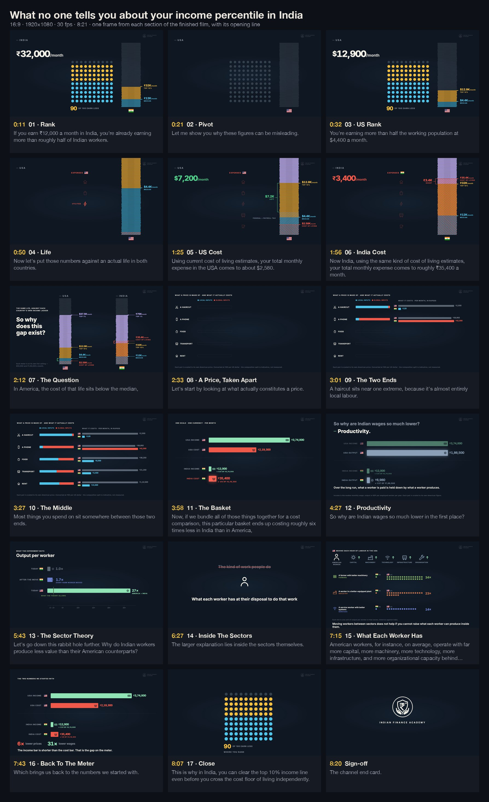

# What no one tells you about your income percentile in India

Published as **It's Not Just You: India Has a Real Structural Economic Problem** —
[watch on YouTube](https://www.youtube.com/watch?v=P9wEO_TRy9E)

16:9 · 1920×1080 · 30 fps · 8:21 · 15,037 frames · source in [`src/income-percentile`](../../src/income-percentile)

**The argument.** ₹32,000 a month puts you in India's top 10% of earners — and still short of what
an ordinary independent urban life costs. The film sets each country's income ladder against the
cost of the same life, takes a price apart into its local and global inputs, and follows the gap
down to what each worker has to work with.

## The visual system

- **Rank and amount are always read together.** A 100-dot percentile field sits beside an income
  "meter" — a stack of notes scaled to each country's own ceiling — so "top 10%" and "₹32,000" are
  one picture, not two captions.
- **Cost of living is hatched over the notes, never replacing them**, so a shortfall is a visible
  overlap on the same ladder rather than a second chart.
- **Numbers are consequences.** Every counter is an odometer mechanically tied to the thing it
  measures: the data changes, the system visibly changes, and only then does the number settle —
  on the exact frame the narrator says it.
- **One set of objects for eight minutes.** The dot field, the meter, the price bars and the basket
  are carried from act to act and re-read, not rebuilt; every act seam overlaps so no frame is
  ever bare.

## What's in this folder

| | |
|---|---|
| [`script.md`](script.md) | the narration as recorded — one line per beat, sections as `##` headings; the parsers read this file |
| [`storyboard.jpg`](storyboard.jpg) | a frame from every section of the final render, with its opening line |
| [`explorations/`](explorations) | alternatives rendered before choosing: three treatments for a scene handover, and four channel end cards (the film uses *quiet*) |

## Source and tooling

| | |
|---|---|
| `src/income-percentile/state.ts` | every timing expression and staged statistic, free of React so the QA gates can import the film's own maths |
| `src/income-percentile/act1.tsx` … `act8.tsx` | the eight acts, each animating against `beat(i)` and word cues |
| `rig.tsx`, `kit.tsx`, `odo.ts`, `writeon.tsx`, `priceb.tsx` | the meter rig, shared parts, odometers, write-on paths, price bars |
| `timing.json`, `cues.json` | the measured beat map and word-level cue frames the film runs on |
| `tools/income-percentile/render.sh` | chunked render with a per-chunk CPU watchdog, then one FFmpeg mux of the narration |
| `tools/income-percentile/retime.py`, `align.py` | rebuild the beat map and cue frames from a recorded read |
| `tools/income-percentile/srt.mjs` | SRT/VTT subtitles cut on the same beats the scenes animate against |
| `tools/income-percentile/qa-*.mjs` | numbers land on the narrated frame · nothing pre-empts its line · easing smoothness · held frames |
