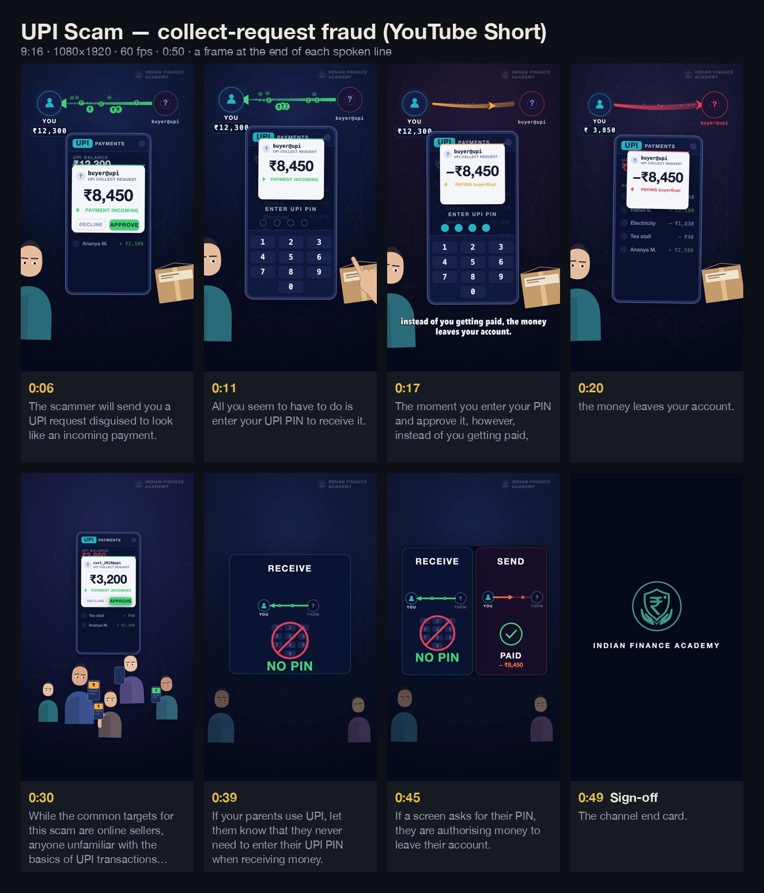

# This UPI Request Can Empty Your Account

UPI collect-request fraud · YouTube Short · 9:16 · 1080×1920 · 60 fps · 0:50 —
[watch on YouTube](https://www.youtube.com/shorts/_GaIGokHL5o) · source in [`src/upi-scam`](../../src/upi-scam)

**The argument.** A UPI "collect request" is dressed up as money coming in, and entering the PIN
sends money out. The film keeps two registers on screen at once — the **ledger** above (what is
actually happening: YOU ↔ THEM) and the **phone** below (what the victim sees) — and links them
physically: the four PIN dots leave the phone and *become* the rupee tokens that travel the ledger.
The authorisation *is* the money, so the reveal lands in both places at once.

## Craft notes

- **One of everything.** One phone, one flow arrow, one request card, one rule object. The seller
  holds the phone, a marketplace assembles around it, a crowd shrinks it to one case among many, and
  the parents take the same device. Nothing is destroyed and rebuilt.
- **78 beats, each anchored to a measured word.** A new read re-times the whole film; the one
  designed hold (after "…leaves your account.") is cut into the audio at its measured length.
- **Readable without colour.** The green→red reversal also reads through direction and position,
  because that is how most people scan a Short.
- **A measured hand.** The pressing hand was rebuilt from a written spec after four attempts that
  drew the right parts and still did not read as a hand ([`hand-spec.md`](hand-spec.md)).

## What's in this folder

| | |
|---|---|
| [`premortem.md`](premortem.md) | 14 ways the plan could fail if followed literally, found before animating, and the fix for each |
| [`production-notes.md`](production-notes.md) | pipeline, the world, screen geography, and every revision round |
| [`hand-spec.md`](hand-spec.md) | how a flat, contour-led drawing reads as a hand pressing a button |
| [`nopin-options.html`](nopin-options.html) | interactive board: five treatments for the "never enter your PIN to receive" rule, side by side (open in a browser) |
| [`recording-script.md`](recording-script.md) | the narration as delivered: holds, pacing, direction, subtitle pages |
| [`script.md`](script.md) | the locked draft narration |
| [`storyboard.jpg`](storyboard.jpg) | a frame from the final render at the end of each spoken line |
